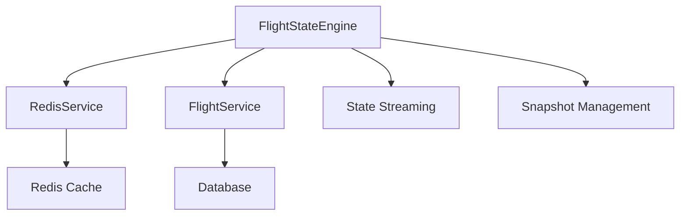
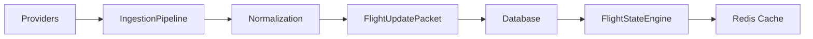
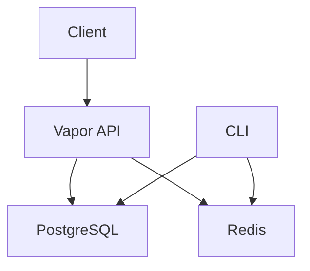

# AeroNexus Architecture Documentation

## Overview

AeroNexus is a modular flight tracking and management system built with Swift and Vapor. The system follows a clean architecture pattern with clear separation of concerns between the core business logic, infrastructure, and presentation layers.

## System Components

### 1. Core Module (AeroNexusCore)

The core module contains all business logic, models, and services that are independent of any specific framework or database.

#### Key Components:

- **Models**: Domain entities and data structures
- **Services**: Business logic and operations
- **DTOs**: Data transfer objects
- **Migrations**: Database schema definitions

### 2. API Module (AeroNexusAPI)

The API module provides HTTP interfaces using Vapor framework.

#### Key Components:

- **Controllers**: HTTP request handlers
- **Routes**: API endpoint definitions
- **Configuration**: Application setup and dependency injection

### 3. CLI Module (AeroNexusCLI)

Command-line interface for administrative tasks and batch operations.

## Flight State Engine Architecture

The FlightStateEngine is a critical component that provides real-time state management and historical snapshots of flight data.

### Components:



### Key Features:

1. **Real-time State Updates**: Uses Redis pub/sub for real-time state changes
2. **Snapshot Management**: Creates and stores point-in-time snapshots of flight states
3. **Caching Layer**: Uses Redis for high-performance caching of flight data and timelines
4. **State Streaming**: Provides Server-Sent Events (SSE) for real-time updates

### Data Flow:

1. **State Updates**: 
   - Client → FlightStateController → FlightStateEngine → Database + Redis Pub/Sub
   - Redis publishes state changes to subscribers

2. **Snapshots**:
   - FlightStateEngine → FlightService → Database
   - FlightStateEngine → Redis (cache snapshot)
   - Snapshot includes: Flight data, current status, timeline, timestamp

3. **Caching**:
   - First request: Database → Cache → Client
   - Subsequent requests: Cache → Client (if cache hit)
   - Cache invalidation on state updates

## Redis Integration

### Caching Strategy:

- **Flight Data**: Cached for 5 minutes (300 seconds)
- **Timeline Data**: Cached for 1 minute (60 seconds)
- **State Snapshots**: Cached for 1 hour (3600 seconds)

### Key Patterns:

- **Cache-Aside**: Application checks cache first, falls back to database
- **Write-Through**: Updates write to both database and cache
- **Pub/Sub**: Real-time state updates via Redis channels

### Redis Keys:

- `flight:cache:flight:{flightId}` - Flight data cache
- `flight:cache:timeline:{flightId}` - Timeline cache
- `flight:snapshot:{flightId}` - State snapshot
- `flight:state:updates` - State update channel

## Database Architecture

### PostgreSQL Schema:

```
flights
  - id
  - number
  - origin
  - destination
  - departure_at
  - arrival_at
  - status
  - aircraft_id (FK)
  - departure_airport_id (FK)
  - arrival_airport_id (FK)
  - scheduled_departure
  - scheduled_arrival

aircrafts
  - id
  - registration_number
  - manufacturer
  - model
  - type
  - capacity
  - year_built
  - status
  - current_airport
  - last_maintenance
  - next_maintenance
  - flight_hours
  - airline

airports
  - id
  - iata_code
  - icao_code
  - name
  - city
  - country
  - latitude
  - longitude
  - altitude
  - timezone
  - runways
  - terminals
  - gates
  - status
  - weather_station
```

### Relationships:

- Flight ↔ Aircraft (Many-to-One)
- Flight ↔ Airport (Many-to-One for departure and arrival)
- Flight ↔ Booking (One-to-Many)
- Flight ↔ TimelineEvent (One-to-Many)

## Ingestion Pipeline



### Process:

1. **Providers** (FakeProvider, HTTPProvider) fetch raw data
2. **Normalization** converts provider-specific data to FlightUpdatePacket
3. **Persistence** stores updates in database
4. **State Engine** processes updates and manages state
5. **Cache** updates Redis with latest data

## Timeline Generation

### Components:

- **TimelineGenerator**: Orchestrates timeline creation
- **TimelineCalculator**: Calculates event times based on aircraft type and airports
- **TimelineValidator**: Validates timeline consistency and business rules

### Calculation Logic:

1. **Standard Durations**: Predefined times for each event type by aircraft category
2. **Airport Adjustments**: Airport-specific modifications (e.g., JFK taxi times)
3. **Dynamic Updates**: Real-time adjustments based on actual events

### Event Types:

- Departure process: gate open, boarding, pushback, taxi, takeoff
- Flight phases: climb, cruise, descent
- Arrival process: landing, taxi, gate arrival, baggage claim

## Deployment Architecture



### Docker Services:

- **app**: Vapor application
- **db**: PostgreSQL database
- **redis**: Redis cache and pub/sub
- **migrate**: Database migration tool

## Performance Considerations

1. **Caching**: Redis caching reduces database load for frequent requests
2. **Real-time Updates**: SSE and Redis pub/sub provide low-latency updates
3. **Batch Processing**: Ingestion pipeline processes updates in batches
4. **Connection Pooling**: Database and Redis connections are pooled

## Error Handling

- **Database Errors**: Automatic retries with exponential backoff
- **Cache Failures**: Graceful degradation to database-only mode
- **Validation Errors**: Comprehensive input validation at all layers
- **State Consistency**: Atomic operations for state transitions

## Monitoring and Logging

- **Structured Logging**: JSON-formatted logs with context
- **Metrics**: Performance metrics for key operations
- **Health Checks**: Endpoints for system health monitoring

## Future Enhancements

1. **Horizontal Scaling**: Support for multiple API instances
2. **Sharding**: Database sharding for large datasets
3. **Advanced Caching**: Multi-level caching strategies
4. **Machine Learning**: Predictive analytics for flight delays
5. **GraphQL API**: Flexible querying capabilities

## Best Practices

1. **Modular Design**: Clear separation of concerns
2. **Dependency Injection**: Easy testing and mocking
3. **Immutable Data**: Thread-safe data structures
4. **Async/Await**: Non-blocking I/O operations
5. **Type Safety**: Strong typing throughout the codebase

## Getting Started

1. **Development**: Use SQLite for local development
2. **Testing**: Comprehensive test suite with mock services
3. **Production**: PostgreSQL + Redis with proper monitoring
4. **Deployment**: Docker containers with health checks

This architecture provides a solid foundation for a scalable, real-time flight tracking system with comprehensive caching and state management capabilities.